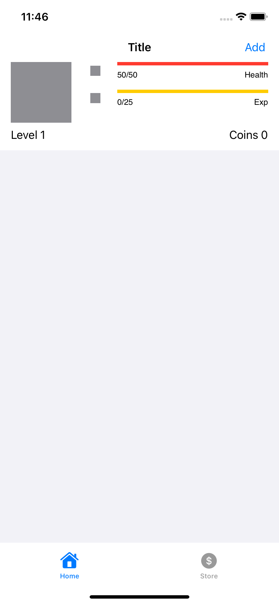
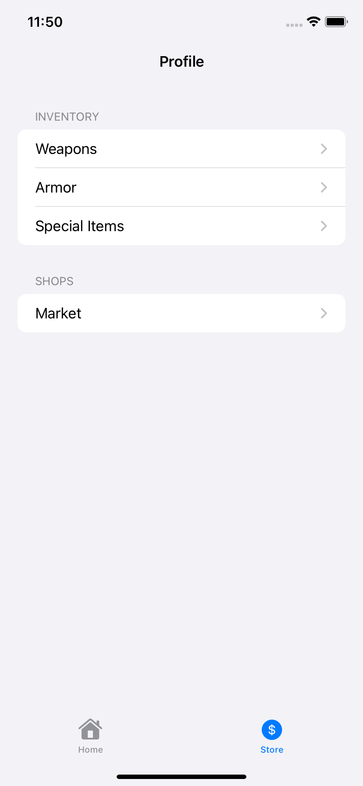

# FitQuest
A fun, cheating proof, gamified fitness app.

## Motivation
One problem I've noticed with fitness apps is that they are dependent on the user, not only actually doing their workout, but marking down that their workout has been completed. 
If someone is keeping track of their workouts, there is nothing stoping them from simply falsely marking the workout as complete.
Other fitness apps don't have a form of proof/verification that the workout goal was actually completed or not.

FitQuest solves this problem by syncing with the user's HealthKit data to verify if their goal has been met or not. 
To assist with motivation, FitQuest gamifies completing a workout by awarding the user with prizes (gold and exp) which can be used to buy cool items.
If a goal is not met, their avatar loses health. If health hits zero, gameover. 

## Who is this for?
Primarily for myself, but for anyone who is willing to be held accountable for their gitness goals.

## Features
- Goal ~ CRUD
- Avatar Leveling system
- Item shopping

### Future planned features
- User Authentication
- challenges

## Tech Stack
- SwiftUI
- HealthKit
- Realm

## Requirements
- XCode 13, Swift 5, iOS 15

## Usage
When you first log in, you will be prompted to allow access to your Health data.

WHen you first open the app, you will have no goals set up. You can add a goal by clicking "Add" on the top right. Select a type of exercise and a difficulty, then tap "Create" to add teh goal. You can also delete or edit an existing goal if you so choose.

     

Upon completion of a goal, user will gail experience and be rewarded with coins. Coins can be used to buy items from the shop.

   

